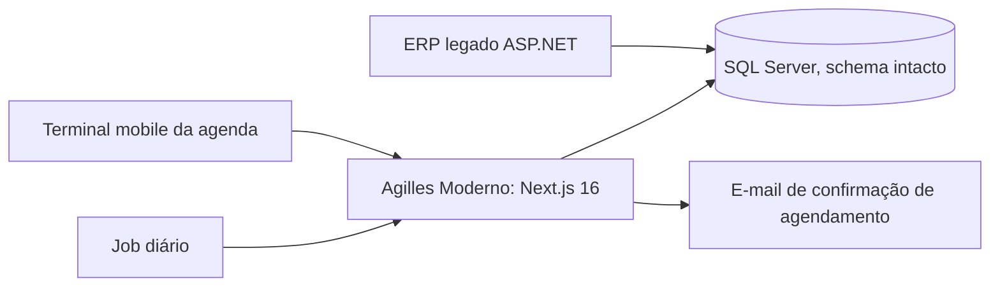

# Agilles Moderno

Migração de um ERP de varejo e serviços, escrito em ASP.NET WebForms, para Next.js. A troca acontece tela por tela, em produção, com o sistema novo e o antigo rodando lado a lado sobre o mesmo banco SQL Server.

Em migração. Código privado. Demonstração sob pedido: rapha.arantes@gmail.com

## O problema

O ERP antigo sustenta agenda, vendas, estoque e financeiro. Reescrever tudo de uma vez obrigaria a parar a operação e migrar os dados.

## Como foi feito

- O sistema novo lê e grava no mesmo banco do antigo, sem alterar nenhuma tabela.
- Cada tela é migrada separadamente, testada em produção e liberada quando está validada. O que ainda não foi migrado continua no sistema antigo.
- Cada módulo tem nível de maturidade documentado (disponível, parcial ou bloqueado), para a equipe saber o que já pode usar.
- Leitura por API Routes e escrita só por Server Actions, como regra fixa do projeto.

## Módulos

Agenda (desktop e terminal mobile para o atendimento), PDV e checkout, financeiro (contas a pagar e a receber, fechamento de caixa, conferência de venda), estoque e compras, produtos, clientes, vale-compras, renegociação (função nova, que não existia no sistema antigo) e confirmação automática de agendamento por e-mail com link assinado.

## Arquitetura

## Stack

Next.js 16 (App Router), React 19, TypeScript, Tailwind CSS, Prisma com adaptador SQL Server, Nodemailer, Vercel.

## Meu papel

Autor da migração.
