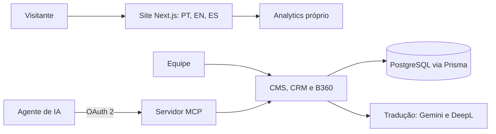

# Plataforma digital da BISPORA Biotecnologia

Site institucional multilíngue com CMS próprio, uma plataforma de inovação aberta (B360) e um servidor MCP que permite a agentes de IA operar o conteúdo e os dados da empresa.

Em produção em bispora.com. O código pertence à BISPORA; atuo como desenvolvedor no projeto.

## O que tem dentro

- CMS próprio, separado do site, com editor TipTap que guarda o conteúdo em JSON.
- Site em português, inglês e espanhol, com tradução de posts por IA em lote (Gemini e DeepL), SEO técnico, sitemap e llms.txt.
- B360: plataforma de inovação aberta que cruza desafios de empresas com soluções, com triagem cega, avaliação, projetos, sprints e apropriação de horas.
- CRM de leads com pipeline e motivos de perda.
- Analytics próprio do site e relatório semanal automático.
- Servidor MCP remoto com OAuth 2: um agente de IA publica e traduz posts, move leads no pipeline, consulta o analytics e opera a B360.

## Arquitetura

## Stack

Next.js 15, React 19, TypeScript, Tailwind CSS 4, Prisma, PostgreSQL (Supabase), Auth.js v5, next-intl, TipTap, Google Generative AI, DeepL.

## Meu papel

Desenvolvimento de sistemas, integração de dados e automação, como bolsista DTI-B no projeto I'Am Verde (FINEP / Rota 2030).
