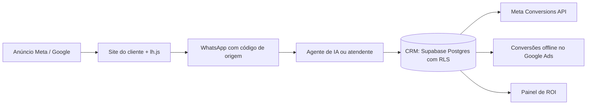

# LeadHub

Plataforma para agências de performance acompanharem cada lead do clique no anúncio até a venda fechada no WhatsApp.

Em produção. Código privado. Demonstração sob pedido: rapha.arantes@gmail.com

## O problema

Em clínicas e serviços de ticket alto, a maior parte das vendas fecha no WhatsApp ou no telefone, longe de qualquer checkout. Meta Ads e Google Ads não enxergam essa venda, então otimizam para clique ou formulário, e a agência não consegue mostrar quais campanhas trazem receita.

## O que o sistema faz

- Um script instalado no site do cliente (`lh.js`) captura as UTMs, registra a origem de cada conversa e esconde os botões flutuantes que já existiam na página.
- O link de WhatsApp leva um código de referência que liga a conversa à campanha.
- Quando o lead avança no funil, a conversão volta para o Meta pela Conversions API, com nova tentativa em caso de falha, e é exportada como conversão offline para o Google Ads.
- CRM com kanban, motivos de perda, tags e importação de CSV.
- Painel com CPL, custo por lead qualificado, CAC, ROAS, ROI, funil e metas.
- Agente de IA no WhatsApp que atende 24 horas, transcreve áudio e passa a conversa para uma pessoa quando precisa.
- Distribuição de leads por unidade, para clientes com mais de uma filial.
- Trilha de auditoria e anonimização de dados para a LGPD.

## Arquitetura

## Stack

Next.js 15 (App Router e Server Actions), React 19, TypeScript, Tailwind CSS 4, Supabase (PostgreSQL com Row-Level Security), Vercel AI SDK com Claude, Gemini e GPT, WAME API para WhatsApp, Resend, Vercel.

## Decisões técnicas

- O isolamento entre clientes é feito no banco, com Row-Level Security, e não só no código.
- A sessão usa JWT assinado em cookie HttpOnly, com proteção contra CSRF.
- Tokens de Meta, Google e WhatsApp são cifrados com AES-256-GCM antes de ir para o banco.
- Toda chamada a URL externa passa por uma camada contra SSRF que fixa o DNS resolvido.

## Meu papel

Responsável pela arquitetura e pelo desenvolvimento: banco, integrações com Meta, Google e WhatsApp, e o agente de IA.
