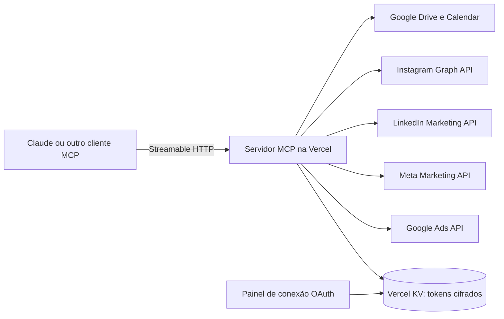

# Servidor MCP para gestão de tráfego: Google Ads, Meta Ads, Instagram e LinkedIn Ads

Servidor MCP que dá a um agente de IA, como o Claude, acesso a várias contas ao mesmo tempo: Google Ads, Meta Ads, LinkedIn Ads, Instagram, Google Drive e Google Calendar.

Em uso no meu trabalho com mídia paga. Código privado. Demonstração sob pedido: rapha.arantes@gmail.com

## O problema

Quem gerencia mídia para vários clientes troca de conta o dia inteiro. Os conectores prontos costumam aceitar uma conta por vez e não cobrem todas as plataformas de que eu preciso.

## O que o servidor faz

São 26 ferramentas. Todas recebem a conta como parâmetro, então o agente sempre sabe em qual cliente está mexendo.

- Google Ads: lista contas e campanhas, lê desempenho, pausa e ativa campanhas, muda orçamento, lista grupos de anúncio, inclui e remove palavras-chave.
- Meta Ads: lista contas e campanhas e lê insights.
- LinkedIn Ads: lista contas e campanhas e lê analytics.
- Instagram: lista contas, lê posts recentes e as métricas de cada post.
- Google Drive e Calendar: busca e lê arquivos, lista e cria eventos.

Um painel web conecta cada conta por OAuth.

## Arquitetura

## Stack

TypeScript, SDK oficial do Model Context Protocol, transporte Streamable HTTP sem estado, Vercel Serverless Functions, Vercel KV, googleapis, Zod.

## Decisões técnicas

- Transporte sem estado: cada chamada é independente, o que encaixa no modelo serverless.
- Cada conta conectada é um registro com serviço, ID, rótulo, tokens, validade e escopos.
- Os tokens são cifrados com AES-256-GCM antes de gravar.

## Meu papel

Autor do projeto.
