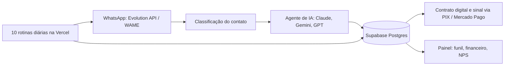

# Viva Acústicos Hub

Sistema que opera a Viva Acústicos, empresa de música ao vivo para eventos e bares em Belo Horizonte. Atende no WhatsApp com IA, fecha contrato, cobra e cuida do pós-evento.

Em produção. Código privado. Demonstração sob pedido: rapha.arantes@gmail.com

## O problema

Contratar música ao vivo envolve muita conversa repetida: tirar dúvida, montar repertório, mandar orçamento, cobrar sinal, lembrar do saldo, pedir avaliação. Feito à mão, isso ocupa o dia, e lead que espera resposta esfria.

## O que o sistema faz

- Classifica cada contato novo na entrada e manda leads de eventos e de bares para o agente de IA.
- O agente responde no WhatsApp com pausas e indicador de digitação, e uma rotina resgata conversas que ficaram sem resposta por falha técnica.
- Follow-up em quatro etapas (36 horas, 4, 8 e 14 dias) que leva em conta a data do evento.
- Contrato com assinatura digital e sinal de 30% por PIX ou Mercado Pago.
- Cobrança automática dos 70% restantes dois ou três dias antes do evento.
- Pesquisa de NPS depois do evento e repasse do cachê aos músicos com a margem visível.
- Prospecção de bares e restaurantes, com quatro abordagens novas por dia útil.
- Dez rotinas diárias agendadas, entre elas um resumo no meu WhatsApp com os leads mais quentes do dia.

## Arquitetura

## Stack

Next.js 15, React 19, TypeScript em modo estrito, Tailwind CSS 4, Supabase (PostgreSQL com RLS, triggers e realtime), Vercel AI SDK com Claude, Gemini e GPT, Evolution API e WAME para WhatsApp, Mercado Pago, Vercel Cron, Vitest, GitHub Actions.

## Decisões técnicas

- Vários modelos de linguagem em cascata, para o atendimento não depender de um provedor só.
- O financeiro do evento é dividido em sinal e saldo, cada um com sua cobrança automática, para nada depender de lembrar de cobrar.
- As rotinas agendadas cobrem vendas, contratos, cobrança, pós-evento e prospecção, cada uma no seu horário.

## Meu papel

Fundador da Viva Acústicos, curador musical e autor do sistema.
